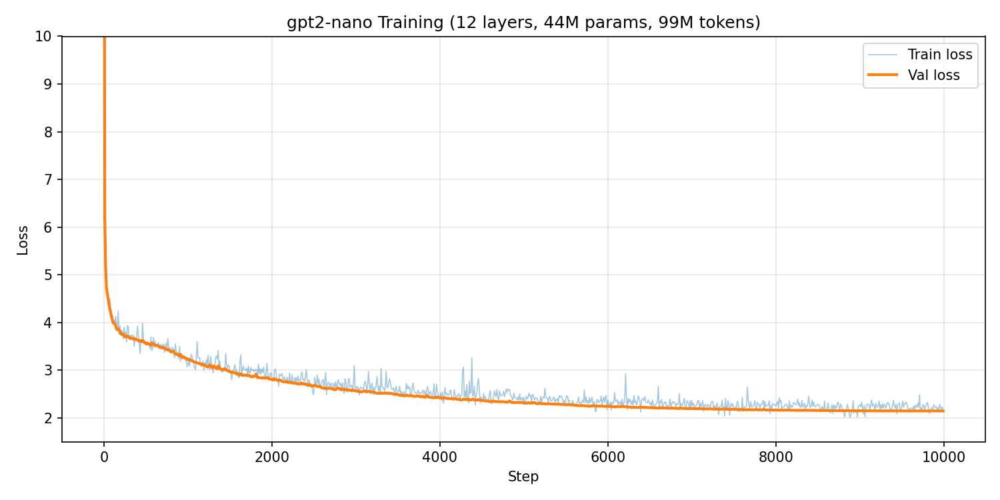

# gpt2-nano

A GPT-2-grade model built from scratch in PyTorch. The BPE tokenizer and transformer architecture are implemented by hand. Training utilities (optimizer, scheduler, loss) use PyTorch built-ins.

**Goal:** Achieve validation loss below 3.0 and generate coherent English sentences from a pre-training loop on FineWeb-edu, running entirely on Apple Silicon MPS.

This is part of a learning series where the goal is to understand every layer of the stack, from raw text to generated output.

## Quick Start

```bash
pip install -r requirements.txt

# Download data, train tokenizer, export shards, then train GPT
python -m data.bpe_tokenizer && python -m src.gpt
```

## Architecture

```
Input tokens  (B, C)                         B = batch size, C = context length, E = embedding dim
    │
    ▼
┌──────────────────────┐
│  Token Embedding     │  nn.Embedding(vocab_size, E)
│  + Sinusoidal PosEnc │  Fixed, not learned
└──────────────────────┘
    │  (B, C, E)
    ▼
┌──────────────────────┐
│  Transformer Block   │  ×12 layers (each identical, independent weights)
│  ├─ LayerNorm + Attn │  Pre-norm, 8 heads, head_dim=64, causal mask
│  ├─ Residual         │
│  ├─ LayerNorm + MLP  │  Pre-norm, Linear(512,2048) → ReLU → Linear(2048,512)
│  └─ Residual         │
└──────────────────────┘
    │  (B, C, E)
    ▼
┌──────────────────────┐
│  LM Head             │  Linear(512, vocab_size) — projects back to token space
└──────────────────────┘
    │  (B, C, vocab_size)
    ▼
  cross_entropy
```

### Model config

| Component | Detail |
|---|---|
| Parameters | ~44M (12 layers) |
| Context length | 1024 tokens |
| Embedding dim | 512 |
| Attention heads | 8 (head_dim = 64) |
| MLP expansion | 4x (512 to 2048 to 512) |
| Positional encoding | Sinusoidal (fixed) |
| Normalization | Pre-norm LayerNorm |
| Activation | ReLU |

### Architecture notes

**Sinusoidal positional encoding**
Original "Attention Is All You Need" used fixed sinusoidal encodings. The key property is that relative positions can be expressed as linear functions of the embeddings, giving the model access to distance information without learned parameters. Modern models use Rotary Position Embeddings (RoPE), which encode relative position directly into the attention computation.

**Multi-head attention mechanics:**
Input (B, C, E) is projected through Q, K, V linear layers, then reshaped to split across heads. Each head computes attention scores independently with a causal mask preventing attention to future tokens. Outputs are concatenated back to (B, C, E).

**Normalization**
Pre-norm (GPT-2+): `out = x + Attention(LayerNorm(x))`. Gradients flow through the residual path unmodified, making training stable at depth. Post-norm (original transformer) applies LayerNorm after the residual add, which can be unstable with many layers.

**Residual connections**
Every block adds its input to its output. This creates a direct path for gradients to flow from the loss to early layers without vanishing through deep chains of nonlinearities.

**MLP**
Attention captures relationships between token positions. The MLP processes each position independently, acting as a learned nonlinear transformation. The 4x expansion (GPT-2 standard) gives the MLP a higher-dimensional intermediate space to store learned patterns.

**Loss function**
Cross-entropy between predicted logits and actual next tokens.

## Tokenizer

Custom BPE tokenizer trained from scratch on FineWeb-edu data. Also includes a SentencePiece-based tokenizer for comparison.

## Training

**Optimizer:** PyTorch's AdamW (lr=3e-4, weight_decay=0.1, cosine LR schedule). Not implemented by hand; uses `torch.optim.AdamW`. The key difference from Adam: AdamW decouples weight decay from the gradient update, applying decay directly to weights rather than through the gradient. This prevents large weights from being under-regularized.

**Gradient clipping:** `clip_grad_norm_(max_norm=1.0)` prevents exploding gradients that cause loss spikes.

**Cosine LR schedule:** Learning rate starts at 3e-4 and decays smoothly to near zero following a cosine curve. This lets the model make large updates early (exploration) and fine-grained updates late (convergence).

**Hardware:** Runs on Apple Silicon GPU via PyTorch MPS backend. Falls back to CPU automatically.

### Training Results (12 layers, ~44M params, 99M tokens)

Trained on Apple Silicon MPS for ~13 hours (46,695s), 10,000 steps.



Final val loss **2.15**, well below the 3.0 target. Val perplexity 8.5 means the model narrows its prediction to ~8.5 tokens on average (from a vocab of 9,157).

### Generated text samples

**Step 500** (loss 3.60, word-level patterns):
> The increas such, low expressed TiPad 1557 dispafid held Trained for realission 2005, was medication 1 is. Mar

**Step 2,500** (loss 2.70, phrase-level coherence):
> The nature of a fals sound, but individual and prevents the colonies were father, and impossible if Pyls notes differ

**Step 5,000** (loss 2.43, sentence fragments):
> The page in pressurer to this take the public vial for the children to teach the game and be Decade Library 9053

**Step 7,500** (loss 2.24, near-grammatical):
> The term reaction to explain in the power structure, propulation states; the movies are vital as they are completely pierarchous.

**Step 9,500** (loss 2.17, coherent structure):
> The Uncovered anthology composer "including scene bulb protection," Bryan L. Wittenskin, 240 Scientists welcomed the

## Comparison with GPT-2

| | gpt2-nano | GPT-2 (small) |
|---|---|---|
| Parameters | ~44M | 124M |
| Layers | 12 | 12 |
| Embedding dim | 512 | 768 |
| Heads | 8 | 12 |
| MLP expansion | 4x | 4x |
| Positional encoding | Sinusoidal (fixed) | Learned embeddings |
| Normalization | Pre-norm LayerNorm | Pre-norm LayerNorm |
| Attention | Standard MHA | Standard MHA |
| Tokenizer | Custom BPE (~9K vocab) | BPE (50,257 vocab) |
| Training data | ~99M tokens (FineWeb-edu) | ~10B tokens (WebText) |
| Optimizer | AdamW (torch) + cosine schedule | Adam |